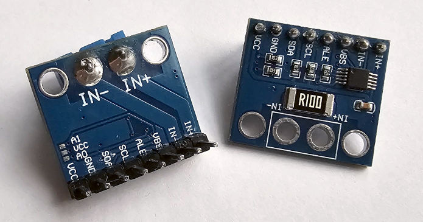

# Toit Library for a TI INA226 Voltage/Current Measurement Module
Toit Driver Library for an INA226 module, DC Shunt Current, Voltage, and Power
Monitor.



## About the Device
The INA226 from Texas Instruments is a precision digital power monitor with an
 integrated 16-bit ADC.  It measures the voltage drop across a shunt resistor to
 calculate current, monitors the bus voltage directly, and internally multiplies
 the two to report power consumption.

## Quick Start Information
Use the following steps to get operational quickly:
- Follow Wiring Diagrams to get the device connected correctly.
- Ensure Toit is installed on the ESP32 and operating.  (Most of the code
  examples require the use `jag monitor` to show outputs.)  See Toit
  Documentation to [get started](https://docs.toit.io/getstarted).
- This is a device using I2C, Toit documentation has a great [I2C
  introduction](https://docs.toit.io/tutorials/hardware/i2c).
- Use one of the code examples to see the driver in operation.

## Core features:
- Measures shunt voltage (±81.92 mV) with 2.5uv resolution.
- Measures bus voltage (0 – 36 V) with 1.25mv resolution.
- Shunt voltage: 2.5 uV/LSB, full-scale ±81.92mV.
- Bus voltage: 1.25 mV/LSB, full-scale code = 40.96v (but input must be ≤36 V).
- Computes current and power using a user-programmable shunt resistor value and
 calibration register (Current and Power are 0 until this is set.)
- Independent conversion times for bus and shunt channels (140 us – 8.3 ms).
- Programmable averaging (1 – 1024 samples) for noise reduction.
- I²C interface - Fast (≤400 kHz) and High-Speed mode up to 2.94 MHz
- Built-in alert system for over/under-voltage, over-current, over-power, and
 conversion ready.
- Operates from a single 2.7 – 5.5 vsupply.

The INA226 device is cheap enough, and suited for power monitoring of small
 devices like microcontrollers, sensors, and IoT or embedded systems loads.
 Many modules come with a R100 shunt resistor onboard, but this can be
 desoldered and changed, and new values assigned when the driver is used.

Further information can be found about this device here:
- [ESPHome description of the
  device](https://esphome.io/components/sensor/ina226/)
- [Module datasheet from Texas
  Instruments](https://www.ti.com/lit/ds/symlink/ina226.pdf)

There are several modules cheaply available based on this chipset.

### Comparison of Sibling Models
Given their similarity, driver library for sibling models were written at the same time:
| Model | [**INA219**](https://github.com/milkmansson/toit-ina219)  | [**INA226**](https://github.com/milkmansson/toit-ina226/) (This driver)  | [**INA3221**](https://github.com/milkmansson/toit-ina3221/) |
| ---- | ---- | ---- | ---- |
| **Channels** | 1 | 1 | 3 (independent but require a common GND and other wiring caveats, see Datasheet.) |
| **Bus/common-mode range** | 0–26 v(bus/common-mode). Bus register full-scale can be configured at 16v or 32v, with caveats (BRNG). | 0–36v common-mode. Bus register full-scale 40.96v but cannot exceed 36v at pins. | 0–26v common-mode; bus register full scale to 32.76v, but input cannot exceed 26v. |
| **Shunt Voltage** | 320mv, depending on PGA config | +/-81.92mv fixed |
| **Device Voltage** | 3.0-5.5 v| 2.7-5.5v | 2.7-5.5v |
| **Averaging options**  | 8 fixed options between 1 and 128.  Averaging and Conversion times are fixed to a limited set of pairs and cannot be set separately. | Several options between 1 and 1024.  All options available in combination with all conversion time options.  | Several options between 1 and 1024.  All options available in combination with all conversion time options. |
| **Current & power registers** | Present (Requires device calibration, performed by the driver) | Present (Requires calibration, performed by the driver)  | Reports shunt & bus per channel but current and power are calulated in software by the driver. |
| **ADC / resolution**  | 9 to 12-bit depending on the register, and averaging/ sampling option selected. | 16-bit | 13-bit |
| **Alerting/Alert pin** | None. "Conversion Ready" exists, but must be checked in software. | Alerts and Alert Pin, but different features from INA3221. | Alerts and Alert pin, but different features from INA226  |
| **Possible I2C addresses** | 16 | 16 | 4 |
| **Datasheets** | [INA219 Datasheet](https://www.ti.com/lit/gpn/INA219) | [INA226 Datasheet](https://www.ti.com/lit/gpn/INA226) | [INA3221 Datasheet](https://www.ti.com/lit/ds/symlink/ina3221.pdf) |
| **Other Notes** | - | - | Has no calibration register - current/power must be calculated in the driver.  Adds 'Power-Valid' window and Summation features.

## Core Concepts

### "Shunt" History
"Shunt" comes from the verb to shunt, meaning to divert or to bypass.  In
railway terms, a shunting line diverts trains off the main track.  In electrical
engineering, a shunt resistor is used to divert current into a measurable path.

Originally, in measurement circuits, shunt resistors were used in analog
ammeters.  A sensitive meter with sensitive needle movement could only handle
very tiny current.  A low-value "shunt" resistor was therefore placed in
parallel to bypass (or shunt) most of the current, so the meter only saw a safe
fraction.  By calibrating the ratio, large currents could be read with a
small meter.

### How it works
The INA226 measures current using a tiny precision resistor (referred to as the
shunt resistor), which is placed in series with the load.  When current flows
through the shunt, a small voltage develops across it.  Because the resistance
is very low (e.g., 0.1 Ohm), this voltage is only a few millivolts even at
significant currents. The INA226’s high-resolution ADC is designed to sense this
tiny voltage drop, precision in the microvolt range.  Ohm’s Law (V = I × R) is
used to compute current.

Simultaneously, the device monitors the bus voltage on the load side of the
shunt. By combining the shunt voltage (for current) with the bus voltage (for
supply level), the INA226 can also compute power consumption.  The INA226 stores
these values in its registers which the driver retrieves using I2C.

# Usage

## Measuring/Operating Modes
The device has two measuring modes: Continuous and Triggered. (Use
`set-measure-mode` to configure this.)

### Continuous Mode
In continuous mode `MODE-CONTINUOUS`, the INA226 loops forever:
- It repeatedly measures bus voltage and shunt voltage.
- Each conversion result overwrites the previous one in the registers.
- The sampling cadence is set using conversion times and averaging settings.
- Typical current draw is 330uA typical, 420 uA max.

Use cases:
- Requiring a live stream of current/voltage/power, e.g. logging consumption of
  an IoT node over hours.
- In cases where the MCU needs to poll for measurements periodically, & expects
  the register to always hold the freshest value.
- Best for steady-state loads or long-term monitoring.

### Triggered Mode
In triggered (single-shot) mode `MODE-TRIGGERED`:
- The INA226 sits idle until a measurement is explicitly triggered (by writing
  to the config register).
- It performs exactly one set of conversions (bus + shunt, with averaging if
  configured).
- Then it goes back to idle (low power).
- Each conversion uses ~330 uA during its active time (typically a few
  milliseconds).

Use cases:
- Low power consumption: e.g. wake up the INA226 once every few seconds/minutes,
  take a measurement, then let both the INA226 and MCU sleep.
- Synchronized measurement: e.g. where a measurement is necessary at the same
  time a load is toggled, eg, so the measurement can be triggered at the right
  time after.
- Useful in battery-powered applications where quiescent drain must be
  minimized.

### Power-Down
INA226 enters ultra-low-power state. No measurements happen. Supply current
drops to 0.5 uA typ (2uA max). Useful for ultra-low power systems where periodic
measurement isn't needed. Use `set-measure-mode MODE-POWER-DOWN` to shutdown.
Start again by setting the required measure mode using `set-measure-mode
MODE-TRIGGERED` or `set-measure-mode MODE-CONTINUOUS`

### Mode Power Consumption

  Mode         | Typical Supply Current | Description
  -------------|------------------------|------------------------------------------------------
  Power-Down   | 0.1 uA (typical)	        | Device is essentially off, no conversions occur.
  Triggered    | appx 330 uA per conversion   | Device wakes up, performs one measurement (shunt or bus or both), then returns to power-down.
  Continuous   | appx 420 uA (typical)	    | Device continuously measures shunt and/or bus voltages.


## Features

### Shunt Resistor Configuration
Most modules seen have R100 resistors onboard, so the driver has a default of
0.100 Ohm.  Set the shunt resistor to a different value when creating the
instance (in Ohms) e.g.,
```Toit
  ina226-driver := Ina226 ina226-device --shunt-resistor=0.100
```
This also takes care of configuring the calibration value, using
`set-calibration-value`.  (A calibration value is required before the IC
starts.)  Can also be instantiated directly into the required mode using
```Toit
  ina226-driver := Ina226 ina226-device --measure-mode=MODE-TRIGGERED
```
Please see below for example resistor values.

### Sampling Rates
The INA226 ADC can average samples together to lower noise and improve accuracy:
averaging many (from 1 to 1024 samples) digitally filters the ADC results. More
averages means less noise readings, but also means slower conversion. Configure
this using the `AVERAGE-**` statics with `get-sampling-rate` and
`set-sampling-rate`.

### Conversion Time
The INA226 has an ADC (Analog-to-Digital Converter) inside. Each measurement
("conversion") of shunt and bus voltages takes some time, depending on how many
internal samples are averaged.  The conversion time setting tells the ADC how
long to spend on a single measurement of either the shunt voltage or the bus
voltage.  Use `TIMING-xxx` statics with the `set-bus-conversion-time` and
`set-shunt-conversion-time` functions.
- Longer time = more samples averaged inside = less noise, higher resolution.
- Shorter time = fewer samples = faster updates, but noisier.

### Conversion Ready/Waiting time
Although the registers can be read at any time, and the data from the last
conversion is always available, the 'Conversion Ready Flag' is provided to help
coordinate one-shot or triggered conversions.

The driver calculates an 'estimated conversion time' using Shunt + Bus
conversion times and sampling value, and adds a 10% margin.  This is used to
compute a maximum wait time for a conversion before giving up.

In triggered mode, if a measurement is triggered using `trigger-measurement`, it
will wait for a maximum of `get-estimated-conversion-time-ms` for a conversion
to complete.  If not using triggered mode, a fresh measurement can be triggered
using `trigger-measurement` (optionally waiting by using the `--wait` flag.)  To
manually wait for measurements in other scenarios, use
`wait-until-conversion-completed` and override the default maximum wait time
estimate using flag `--max-wait-time-ms=xxxx`.

### Measurement Functions
The INA226 really measures two things internally:
1. V(shunt) = IN+ - IN-  (a small differential voltage across the shunt)
2. V(bus)   = the "bus/load" node/pin voltage.

From these, the driver computes current and power, and reconstructs the upstream
supply.  On many boards, VBUS is often internally tied to IN− (the low side of the shunt).  If the module in use different (VBUS not tied to IN−), the meanings below
still hold, although "bus voltage" would then refer to whatever is wired to VBUS.

- `read-shunt-voltage`: The voltage drop across the shunt: Vshunt = IN+ − IN−.
  Given in Volts
- `read-bus-voltage`: The "load node" voltage. If VBUS is not tied to IN−, the
  function returns whatever VBUS is wired to.  Given in Volts.
- `read-supply-voltage`: The upstream/source voltage *before* the shunt
(Vsupply ≈ Vbus + Vshunt = (voltage at IN−) + (IN+ − IN−) = voltage at IN+.
Given in Volts.
- `read-shunt-current`: The current through the shunt and load load, in amps.
Internally, the chip uses a calibration constant set from the configured shunt
resistor value. Given in Amps. Caveats:
  - Accurate only if shunt value in code matches the physical shunt.
  - Choose appropriate averaging/conversion time for scenario.
- `read-load-power`: Power delivered to the load, in watts. Caveats:
  - Because Vbus is after the shunt, this approximates power at the load (not at
  the source).
  - Depends on correct calibration.  (Calibration values are care of in this
    driver when setting `set-shunt-resistor`, and set to 0.100 Ohm by default).

### Alerting
The INA226 has alerts that both drive an external pin, whilst also being able to
be read in software.  Alerts can be configured for several conditions, such as
over- or under-voltage (on the shunt or bus), over-current or over-power.
Additionally, it can be configured to trigger on 'conversion-ready', indicating
that new data is available, useful especially in triggered mode.

Only one alert function can be active at a time since the alert pin is shared.
Therefore there is only one configuration register in the IC storing threshold
information for the configured alert.  This driver takes care of these issues by
clearing all other alerts when configuring a new one.  Configure the alert type
using `set-xxx-alert` functions. When using:
- Those requiring an alert value, this must be provided (in major SI units).
- Given there is only one alert pin, only one function can be enabled at once.

Because the alert mechanism is evaluated against the most recent ADC conversion,
its response time is limited by the selected conversion times and averaging
settings.  Longer averaging means more stable results but slower alerts.  This
makes the Alert features most useful for catching sustained fault conditions (like
over-current or brownout) rather than fast transients.

### Alert Latching
When the Alert Latch Enable bit is set to Transparent mode, the Alert pin and
Flag bit resets to the idle states automatically when the fault has returned to
normal.  However, when the Alert Latch Enable bit is set to Latch mode, the
Alert pin and the Alert Flag bit will remains activated following a fault and stay that way until cleared manually.
- Alert latching can be configured using `set-alert-latching`.
- Clear alerts using `clear-alert`
- Alert pin poliarity using `set-alert-pin-polarity`.

### Changing the Shunt Resistor
Many INA226 modules ship with 0.1 Ohm or 0.01 Ohm shunts.
- For high-current applications (tens of amps), the shunt can be replaced with a
  much smaller value (e.g. 1–5 mOhm). This reduces voltage drop and wasted power,
  and raises the maximum measurable current, but makes the resolution for tiny
  currents coarser.
- For low-current applications (milliamps), a larger shunt (e.g. 0.5–1.0 Ohm)
increases sensitivity and resolution, but lowers the maximum measurable current
(≈80 mA with a 1 Ohm shunt) and burns more power in the resistor itself.

> [!IMPORTANT]
> If the shunt is changed, always add a line to the beginning of the code to
> set the shunt resistor value every boot.  The device cannot detect it, and
> the driver does not store these values permanently.


### Shunt Resistor Values
The following table illustrates consequences to current measurement with some sample shunt resistor values:

Shunt Resistor (SR) | Max Measurable Current | Shunt Resistor Wattage Requirement  | Resolution per bit | Note
-|-|-|-|-
1.000 Ohm	| 81.92 mA | 0.125w (min) | 2.5 uA/bit | Very fine resolution, only good for small currents (<0.1 A).
0.100 Ohm (default) | 0.8192 A | 0.125 W (min) 0.25 W (safer) | 25 uA/bit | Middle ground; good for sub-amp measurements.
0.050 Ohm | 1.6384 A | 0.25 W (min) 0.5 W (safer) | 50 uA/bit | Wider range; 0.25 W resistor recommended, or higher for margin.
0.010 Ohm | 8.192 A | 1 W (min) 2 W (preferred) | 250 uA/bit | High range but coarser steps. Use ≥1 W shunt - mind heating & layout.

# About this library
This library begun as a port of work originally done by Wolfgang Ewald
<WEwald@gmx.de> and Originally published on
  [Github](https://github.com/wollewald/INA226_WE).

## Issues
If there are any issues, changes, or any other kind of feedback, please
[raise an issue](https://github.com/milkmansson/toit-ina226/issues). Feedback is
welcome and appreciated!

## Disclaimer
- This driver has been written and tested with an unbranded INA226 module.
- All trademarks belong to their respective owners.
- No warranties for this work, express or implied.

## Credits
- Wolfgang (Wolle) Ewald <WEwald@gmx.de> for the original code [published
  here](https://github.com/wollewald/INA226_WE)
  - https://wolles-elektronikkiste.de/en/ina226-current-and-power-sensor
    (English)
  - https://wolles-elektronikkiste.de/ina226 (German)
- Rob Tillaart's work [here](https://github.com/RobTillaart/INA226) which helped
  me understand and correct the work
- AI has been used for code and text reviews, analysing and compiling data and
  results, and assisting with ensuring accuracy.
- [Florian](https://github.com/floitsch) for the tireless help and encouragement
- The wider Toit developer team (past and present) for a truly excellent product

## About Toit
One would assume you are here because you know what Toit is.  If you dont:
> Toit is a high-level, memory-safe language, with container/VM technology built
> specifically for microcontrollers (not a desktop language port). It gives fast
> iteration (live reloads over Wi-Fi in seconds), robust serviceability, and
> performance that’s far closer to C than typical scripting options on the
> ESP32. [[link](https://toitlang.org/)]
- [Review on Soracom](https://soracom.io/blog/internet-of-microcontrollers-made-easy-with-toit-x-soracom/)
- [Review on eeJournal](https://www.eejournal.com/article/its-time-to-get-toit)
